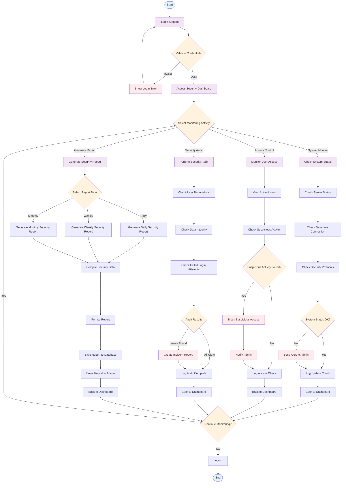

# Gambar 3.2. Activity Diagram Satpam - Sistem Keamanan

## Deskripsi Activity Diagram Satpam

### Alur Utama Kegiatan Satpam:

1. **Login Process**
   - Satpam melakukan login dengan kredensial
   - Sistem memvalidasi kredensial
   - Jika tidak valid, tampilkan error dan kembali ke login
   - Jika valid, akses dashboard keamanan

2. **Dashboard Monitoring**
   - Satpam memilih aktivitas monitoring:
     - System Monitor
     - Access Control
     - Security Audit
     - Generate Report

3. **System Monitor**
   - Cek status server
   - Cek koneksi database
   - Cek protokol keamanan
   - Jika ada masalah, kirim alert ke admin
   - Log hasil pemeriksaan sistem

4. **Access Control**
   - Lihat pengguna yang sedang aktif
   - Cek aktivitas mencurigakan
   - Jika ditemukan aktivitas mencurigakan:
     - Block akses
     - Notifikasi admin
   - Log pemeriksaan akses

5. **Security Audit**
   - Cek permission pengguna
   - Cek integritas data
   - Cek percobaan login yang gagal
   - Jika ditemukan masalah, buat incident report
   - Log audit selesai

6. **Generate Report**
   - Pilih tipe laporan (Daily/Weekly/Monthly)
   - Compile data keamanan
   - Format laporan
   - Simpan ke database
   - Email laporan ke admin

7. **Continue or Logout**
   - Satpam dapat melanjutkan monitoring atau logout
   - Jika logout, sesi berakhir

### Fitur Keamanan:
- **Real-time Monitoring**: Pemantauan sistem secara real-time
- **Automated Alerts**: Alert otomatis untuk admin
- **Incident Reporting**: Pelaporan insiden keamanan
- **Access Control**: Kontrol akses pengguna
- **Audit Trail**: Jejak audit untuk semua aktivitas