# Gambar 3.1. Use Case Diagram - Sistem E-Commerce Enthusias

```mermaid
graph TB
    %% Actors
    Customer[👤 Customer]
    Admin[👨‍💼 Admin]
    Satpam[🛡️ Satpam]
    
    %% System boundary
    subgraph "Sistem E-Commerce Enthusias"
        %% Customer Use Cases
        UC1[Browse Products]
        UC2[Search Products]
        UC3[View Product Details]
        UC4[Add to Cart]
        UC5[View Cart]
        UC6[Remove from Cart]
        UC7[Checkout]
        UC8[Place Order]
        UC9[Track Order]
        UC10[View Order History]
        
        %% Admin Use Cases
        UC11[Login Admin]
        UC12[Manage Products]
        UC13[Add Product]
        UC14[Edit Product]
        UC15[Delete Product]
        UC16[Manage Categories]
        UC17[View Orders]
        UC18[Update Order Status]
        UC19[Manage Users]
        UC20[View Reports]
        
        %% Satpam Use Cases
        UC21[Monitor System]
        UC22[Check Security]
        UC23[Validate Access]
        UC24[Generate Security Report]
    end
    
    %% Customer relationships
    Customer --> UC1
    Customer --> UC2
    Customer --> UC3
    Customer --> UC4
    Customer --> UC5
    Customer --> UC6
    Customer --> UC7
    Customer --> UC8
    Customer --> UC9
    Customer --> UC10
    
    %% Admin relationships
    Admin --> UC11
    Admin --> UC12
    Admin --> UC13
    Admin --> UC14
    Admin --> UC15
    Admin --> UC16
    Admin --> UC17
    Admin --> UC18
    Admin --> UC19
    Admin --> UC20
    
    %% Satpam relationships
    Satpam --> UC21
    Satpam --> UC22
    Satpam --> UC23
    Satpam --> UC24
    
    %% Include relationships
    UC12 -.->|include| UC13
    UC12 -.->|include| UC14
    UC12 -.->|include| UC15
    UC7 -.->|include| UC8
    UC21 -.->|include| UC22
    UC21 -.->|include| UC23
```

## Deskripsi Use Case

### Customer (Pelanggan)
- **Browse Products**: Melihat daftar produk yang tersedia
- **Search Products**: Mencari produk berdasarkan kata kunci
- **View Product Details**: Melihat detail produk termasuk harga, deskripsi, dan gambar
- **Add to Cart**: Menambahkan produk ke keranjang belanja
- **View Cart**: Melihat isi keranjang belanja
- **Remove from Cart**: Menghapus produk dari keranjang
- **Checkout**: Melakukan proses pembayaran
- **Place Order**: Melakukan pemesanan
- **Track Order**: Melacak status pesanan
- **View Order History**: Melihat riwayat pesanan

### Admin (Administrator)
- **Login Admin**: Masuk ke sistem admin
- **Manage Products**: Mengelola produk (CRUD)
- **Add Product**: Menambah produk baru
- **Edit Product**: Mengubah informasi produk
- **Delete Product**: Menghapus produk
- **Manage Categories**: Mengelola kategori produk
- **View Orders**: Melihat daftar pesanan
- **Update Order Status**: Mengubah status pesanan
- **Manage Users**: Mengelola data pengguna
- **View Reports**: Melihat laporan penjualan

### Satpam (Security Guard)
- **Monitor System**: Memantau keamanan sistem
- **Check Security**: Memeriksa keamanan akses
- **Validate Access**: Memvalidasi akses pengguna
- **Generate Security Report**: Membuat laporan keamanan